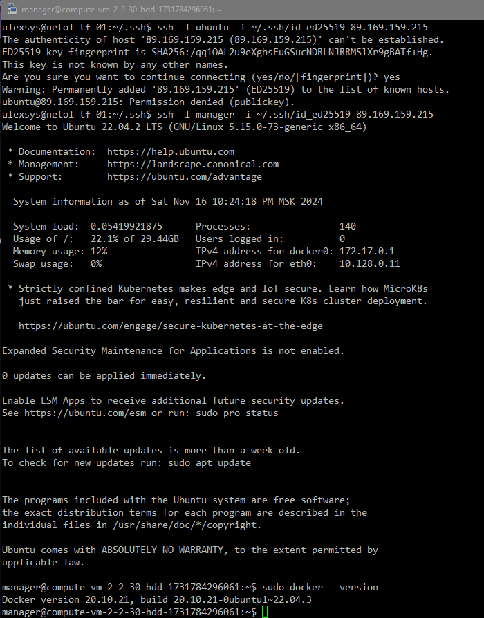
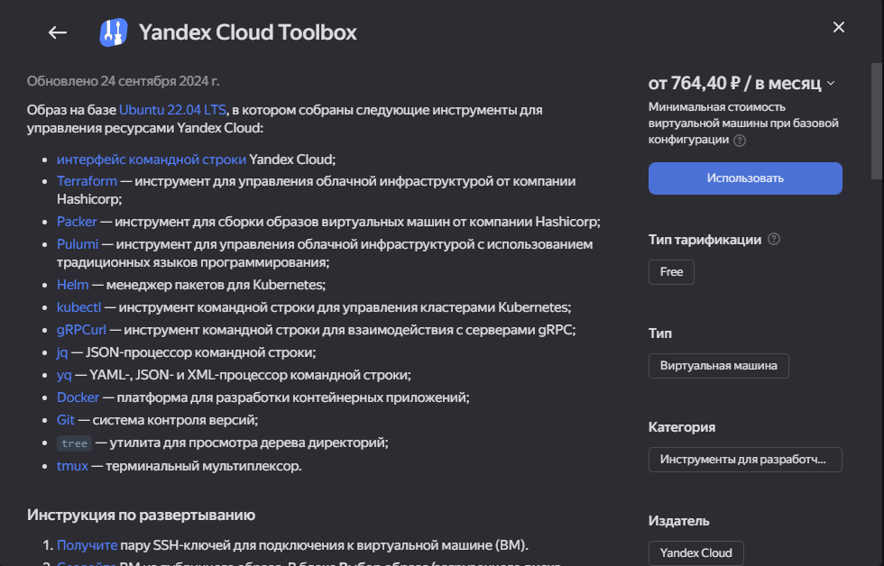

# 01. Введение в виртуализацию

### Задача 1. 
Создали виртуальную машину:

Подключились по ssh:

Кроме docker, данный образ содержит множество других инструментов для работы с Я-облаком, автоматизации и разработки:

Прошли сутки. Машина остановлена.

### Задача 2. Выбор платформы
   -  высоконагруженная база данных MySql, критичная к отказу. - Скорее виртулизация + HA. Это позволит не зависеть от "железа" и продолжать работать в случае отказа физического сервера.
Хотя, в каких-то случаях, возможно и понадобится физический сервер(ы).
   - различные web-приложения - виртуализация уровня ОС. Docker, Kuberbetes и т.д. Управляемость и скорость развертывания/масштабирования.
   - Windows-системы для использования бухгалтерским отделом - если речь не про рабочие станции, то - паравиртуалитзация. Hyper-V или другой гипервизор.
   - системы, выполняющие высокопроизводительные расчёты на GPU - напрашивается физический сервер, но всё зависит от задач и возможностей. 
И гипервизоры и оборудование уже вполне уверенно поддерживают виртуализацию GPU. 
В каких-то ситуациях вполне допустимо использовать и монопольный "проброс" GPU в конкретную ВМ.  

### Задача 3. 
    
1. Hyper-v. Возможно, VMWare vSphere. Не уверен, что hyper-v всё умеет. 
2. Xenserver/XCP-NG или Proxmox. возможности примерно похожи у обоих. Лично я - за XEN. Он просто работает. 
   Плюс живая миграция между кластерами/отдельными нодами - это всё-таки необходимость.
3. Hyper-V server. Он, вроде, всё ещё бесплатен.
4. Рабочая станция/сервер с docker, или с VirtualBox и набором ВМ с нужными операционными системами, 
если ПО требует графического окружения и взаимодействия с пользователем. 
 
### Задача 4. 
В использовании гетерогенной среды виртуализации видится целый ряд недостатков:
- Отсутствие централизованного управления. Различия в подходах/инструментах управления повышают шанс человеческих ошибок.
- Сложность управления общими ресурсами. Например, дисковым пространством. 
Необходимость разделять или вовсе использовать разные СХД для каждой среды.
- Затруднённое манипулирование инфраструктурой. Сложность, а то и невозможность оперативной миграции из одной среды
в другую приведут к проблемам, а то и вовсе к катастрофе, в случае краха одной из сред.

Если уж сложилась такая ситуация, то нужно постараться максимально логически разделить инфраструктуру между средами так,
чтобы изменения не требовали одновременного взаимодействия с обеими средами, и обе среды имели достаточный запас ресурсов. 
А так же постараться использовать независимые от среды, единые средства управления, такие как Vagrant или Terraform, 
чтобы свести к минимуму риск ошибок. И параллельно задуматься о том, как свести свои ресурсы к какой-то единой среде.
Я не стал бы специально создавать с нуля гетерогенную структуру.
