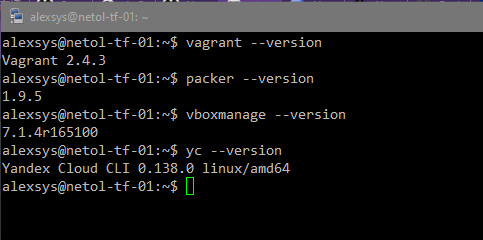
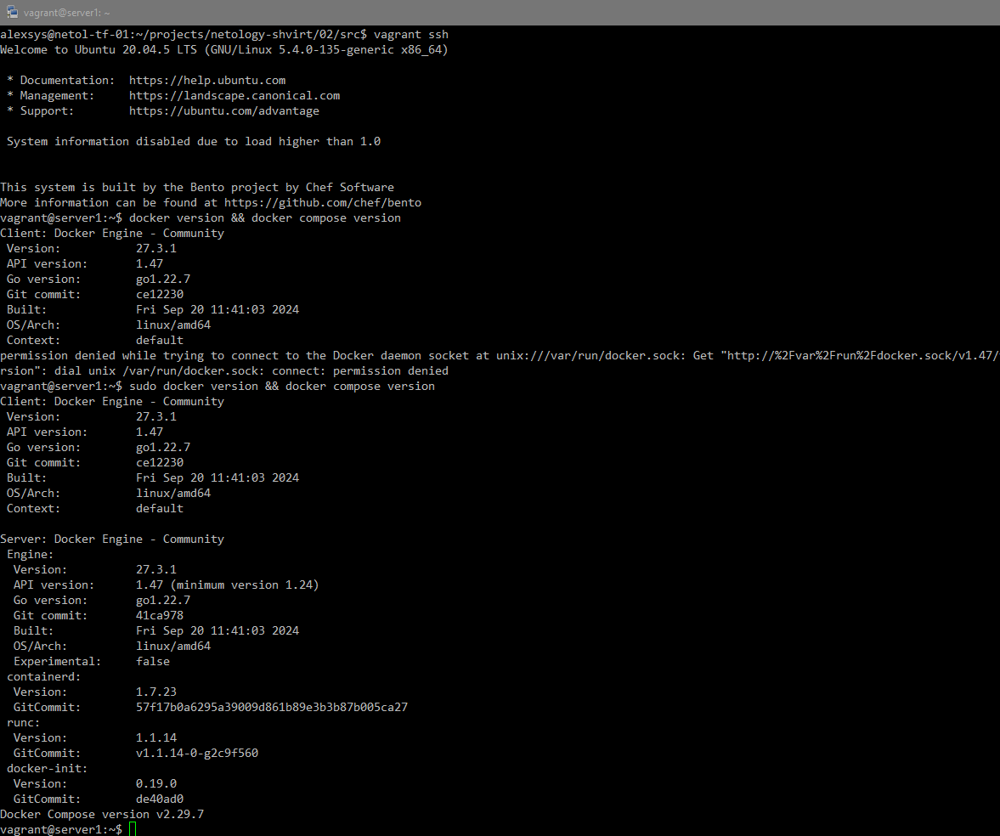
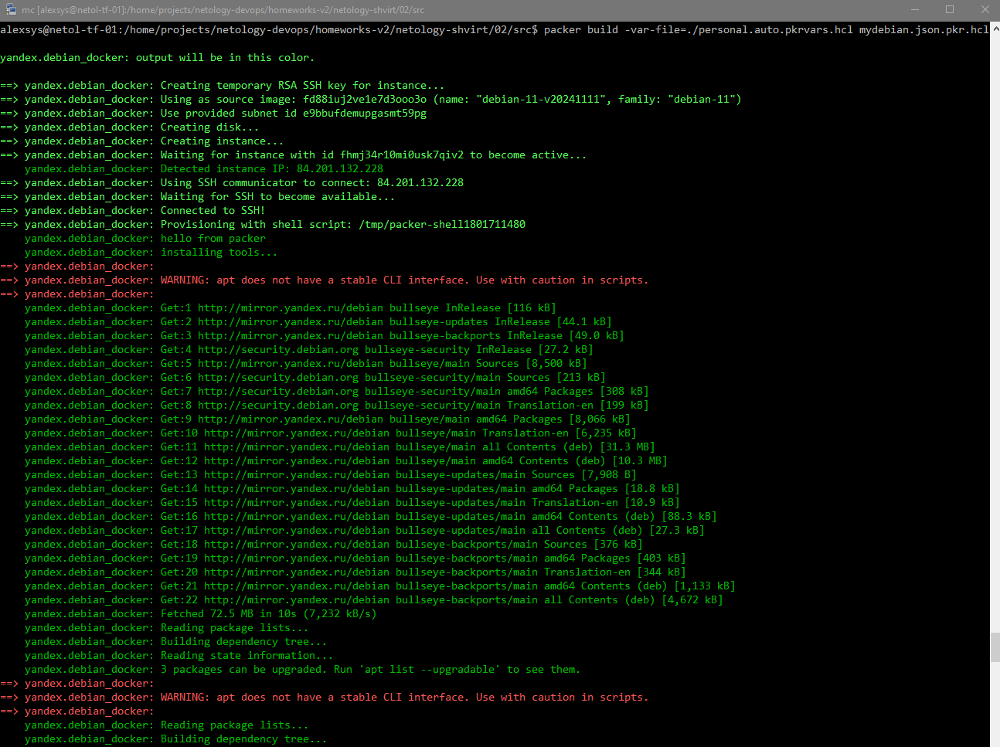
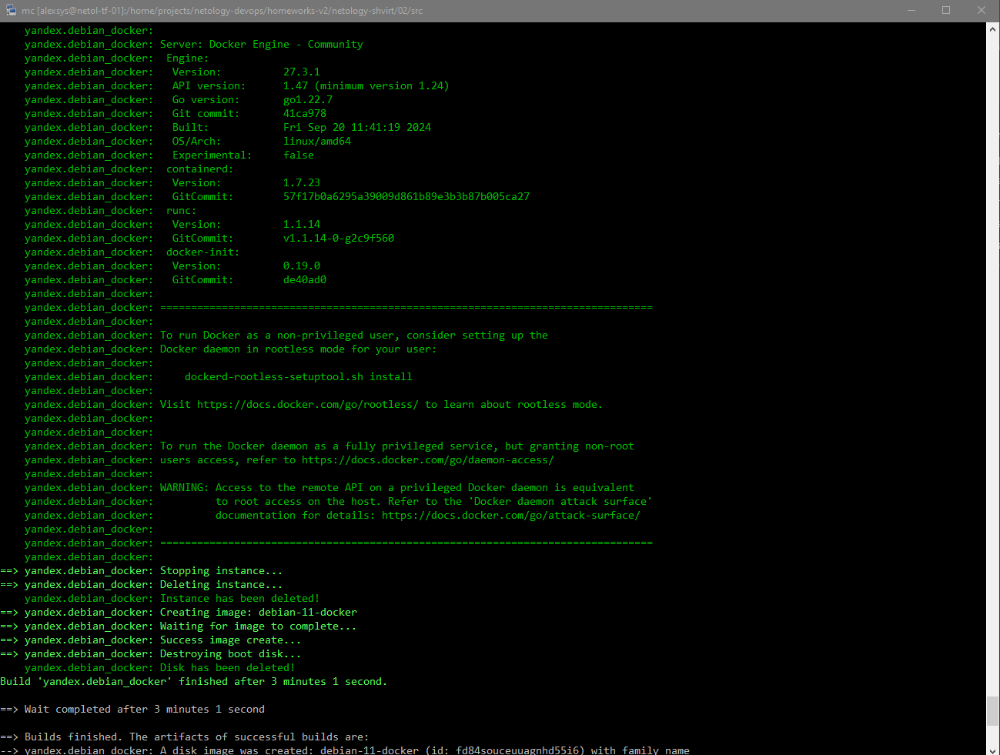
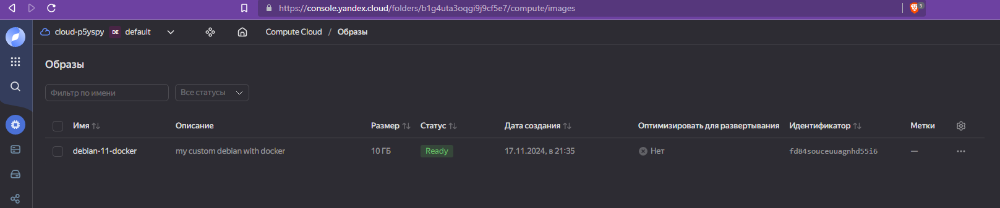
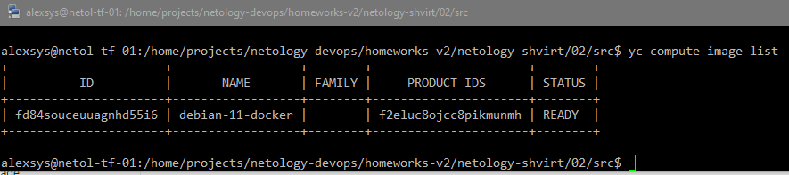
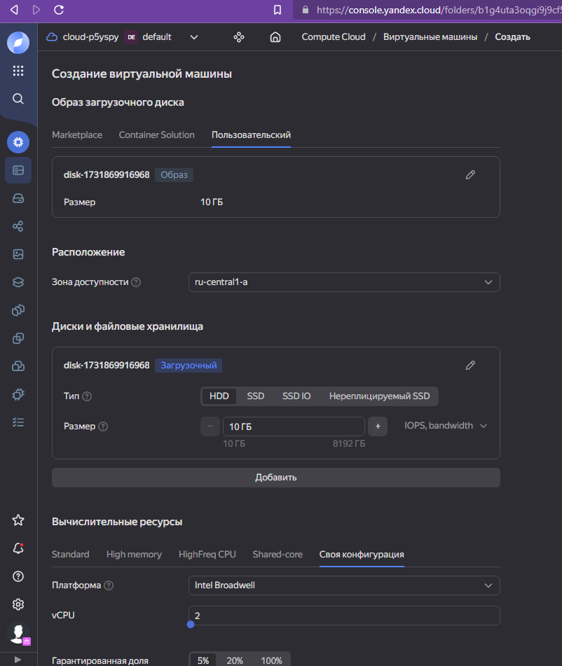
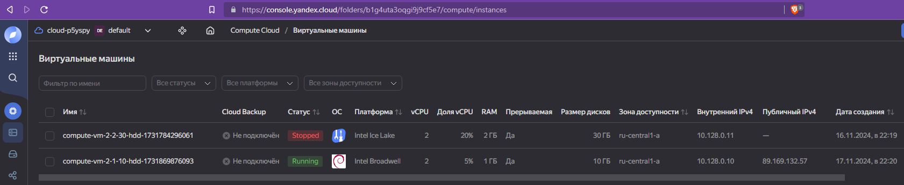
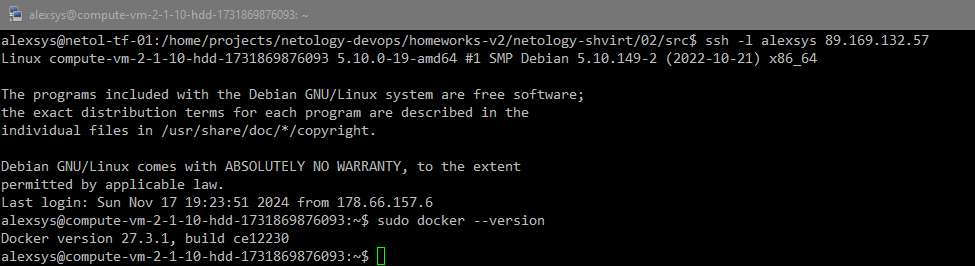

# 02. Применение принципов IaaC в работе с виртуальными машинами

### Задача 1. 
Установили необходимые инструменты:



### Задача 2. 
 Используем Vagrant.
Работаем в режиме Nested Virtualization: Win10 host - VirtualBox - Debian 12 VM - VirtualBox - наша тестовая ВМ.
С первого раза полностью процесс не завершился: рабочая ВМ упала в момент запуска vagrant-ом созданной ВМ. 
Со второго всё прошло успешно. Зашли в ВМ, убедились, что там есть docker:



Повторить "падение" не удалось. Запуск этой или другой вложенной ВМ вручную, `vagrant destroy - vagrant up` отрабатывают штатно.  
### Задача 3. 
Используем Packer.
1. Предварительно с помощью команд ` yc resource-manager folder list` && `yc vpc subnet list` 
находим идентификаторы каталога и нужной подсети вв нашем облаке.  
Изменяем файл [`mydebian.json.pkr.hcl`](src/mydebian.json.pkr.hcl). Добавляем установку htop, tmux и docker:
```hcl
provisioner "shell" {
    inline = [
      "echo 'hello from packer'",
      "echo 'installing tools...'",
      "sudo apt update",
      "sudo apt -y install curl htop tmux",
      "echo 'installing docker...'",
      "curl -fsSL https://get.docker.com | sudo sh" 
    ]
  }
```
Выполняем `packer build`:



Успешно.



2. Находим наш образ в веб-консоли:



Или с помощью команды `yc compute image list`:



3. Создаём ВМ на основе нашего образа:



Готово:



Подключаемся, проверяем, что там есть docker:



### Задача 4. 
