# 02. Оркестрация группой Docker контейнеров на примере Docker Compose

### Задача 1. 
 - Скачиваем образ nginx командой `docker image pull nginx:1.21.1`.
 - Создаём простой dockerfile вида

```
FROM nginx:1.21.1
COPY --chmod=644 index.html /usr/share/nginx/html/index.html
```
и собираем командой `docker build . -t avssys/custom-nginx:1.0.0`.

Отправляем собранный образ в репозиторий командой  `docker push avssys/custom-nginx:1.0.0`:

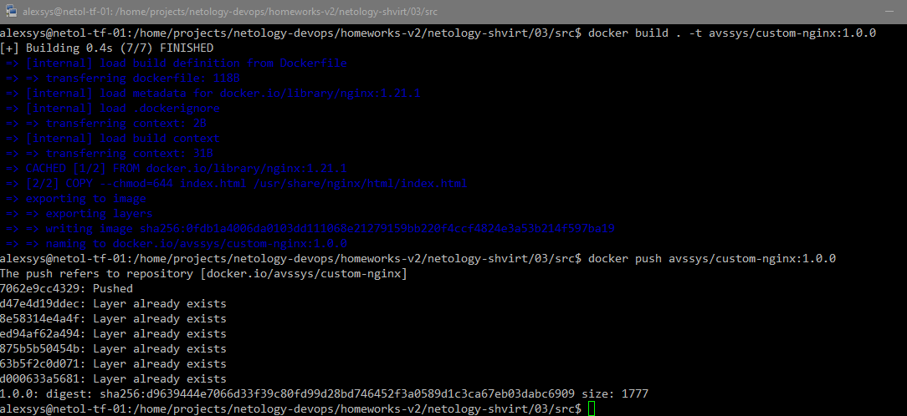

Теперь он доступен в репозитории по адресу [https://hub.docker.com/repository/docker/avssys/custom-nginx/general](https://hub.docker.com/repository/docker/avssys/custom-nginx/general)

### Задача 2. 
1. Запускаем контейнер командой `docker run -d --name AVSigachev-custom-nginx-t2 -p 8080:80 avssys/custom-nginx:1.0.0`.
Убеждаемся, что он работает и страница доступна:

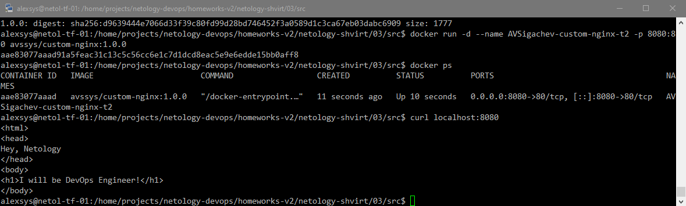

2. Переименовываем командой `docker container rename AVSigachev-custom-nginx-t2 custom-nginx-t2`
Убеждаемся, что контейнер работает и у него соответствующее имя:

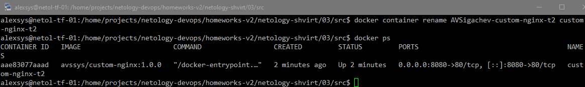

3. Выполняем команду `date +"%d-%m-%Y %T.%N %Z" ; sleep 0.150 ; docker ps ; ss -tlpn | grep 127.0.0.1:8080  ; docker logs custom-nginx-t2 -n1 ; docker exec -it custom-nginx-t2 base64 /usr/share/nginx/html/index.html`

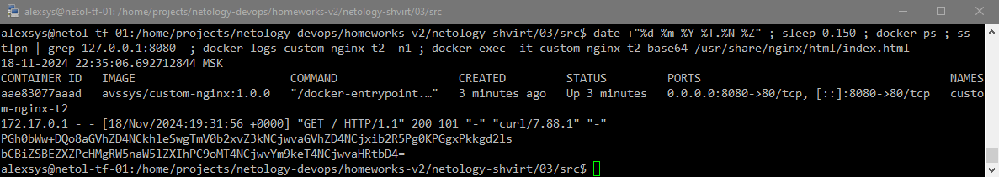

4. Убеждаемся, что страница доступна с помощью curl:

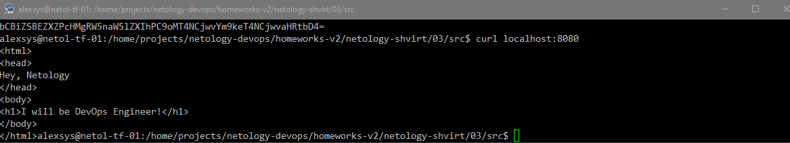

### Задача 3. 
Подключаемся к консоли контейнера с помощью команды `docker attach` и нажимаем Ctrl+C:

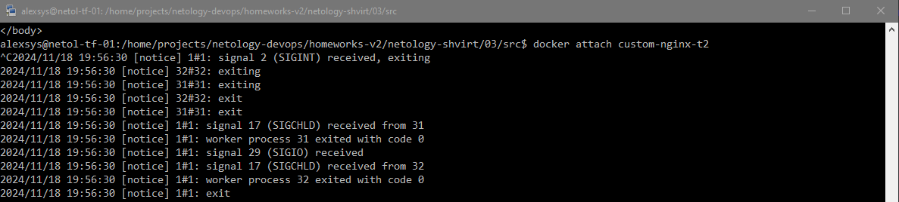

Контейнер завершает работу:

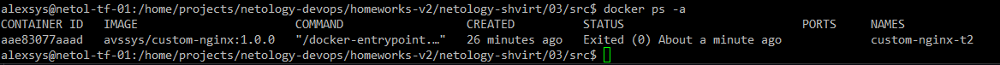

Это происходит потому, что завершается процесс, указанный в качестве команды запуска в контейнере - собственно nginx, 
который запущен не в режиме демона, а присоединенным к стандартным потокам ввода-вывода. 

Перзапускаем контейнер командой `docker start custom-ngnx-t2`

Заходим в терминал командой `docker exec -t -i custom-nginx-t2 /bin/bash`и ставим nano:

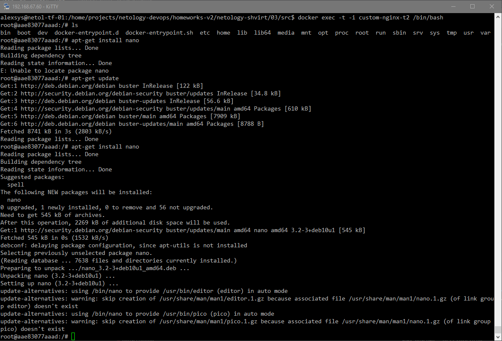

Редактируем `default.conf`, перегружаем конфигурацию nginx и проверяем, что он доступен по новому порту:

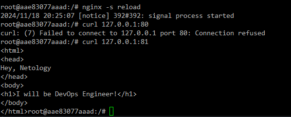

Проверяем, что произошло на хосте:


Страница больше не доступна, порт 8080 никто не слушает. Что логично: конфигурация контейнера не изменилась и новый порт
сам по себе не пробросился.

Чтобы исправить ситуацию не пересоздавая контейнер, можно изменить вручную его конфигурационные файлы.

Для этого нам понадобится узнать ID контейнера при помощи `docker ps -i`, остановить его, остановить сервис docker
и изменить в папке `/var/lib/docker/containers/<container ID>/` файлы `hostconfig.json` и `config.v2.json`:

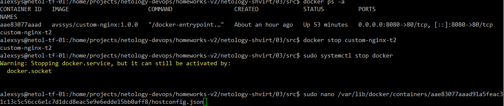

В первом находим раздел "PortBindings" и изменяем маппинг порта, во втором в разделе ExposedPorts меняем собственно
проброшенный порт на 81. Проверяем:

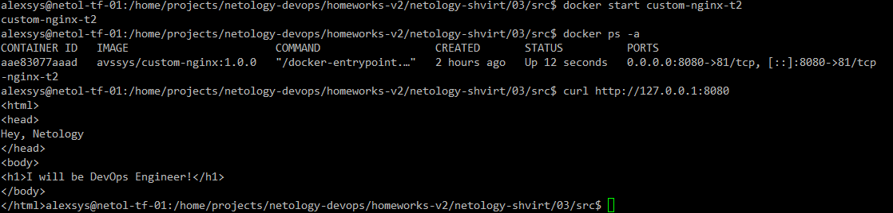

Работает.

Удаляем контейнер командой `docker rm -f`:

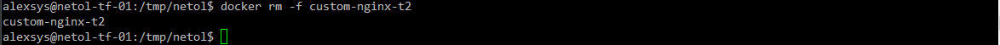

### Задача 4.
Создаём два контейнера из образов centOS и debian latest:

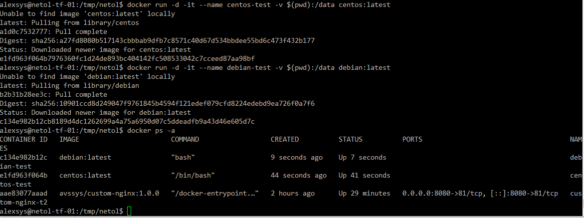

Создаём файлы из контейнера CentOS и с хоста, и проверяем в контейнере Debian:

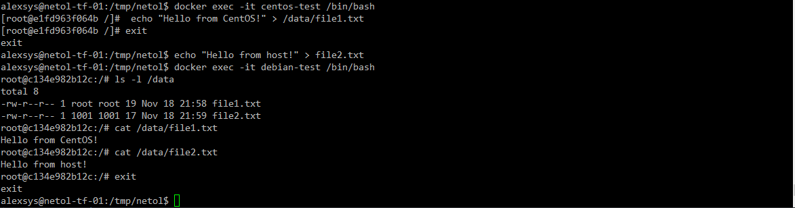

### Задача 5.
 - Создаём во временном каталоге файлы `compose.yaml` и `docker-compose.yaml`.
При выполнении команды `docker compose up` выполнится только первый:

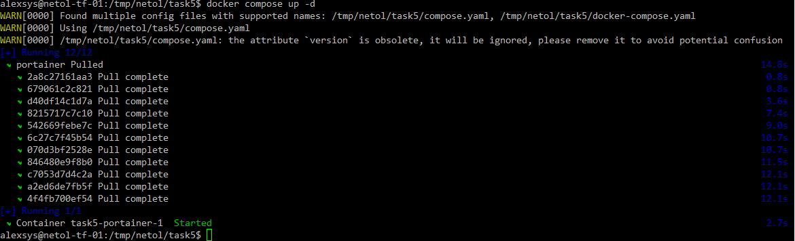

Это происходит потому, что  название `docker-compose.yaml` является устаревшим и поддерживается для совместимости. 
При наличии обоих файлов в рабочем каталоге, предпочтение отдаётся первому, о чём сам compose даже предупреждает.

- Чтобы исполнилось содержимое обоих файлов, добавим в `compose.yaml` директиву **include**:
```yaml
include:
  - docker-compose.yaml
```
и запустим ещё раз:

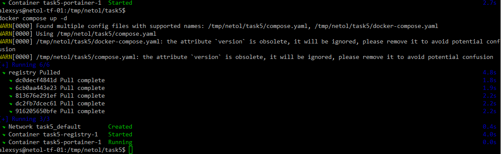

- Опубликуем наш образ nginx в созданный локальный registry:

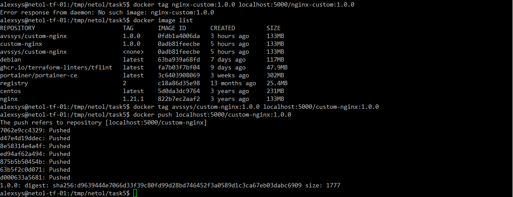

- Инициализируем Portainer. 

    *Если не зайти на страницу сразу после запуска контейнера, то интерфейс блокируется, приходится пересоздавать.*

    *Работаем в ВМ без GUI, поэтому заходим в итерфейс с хоста*.

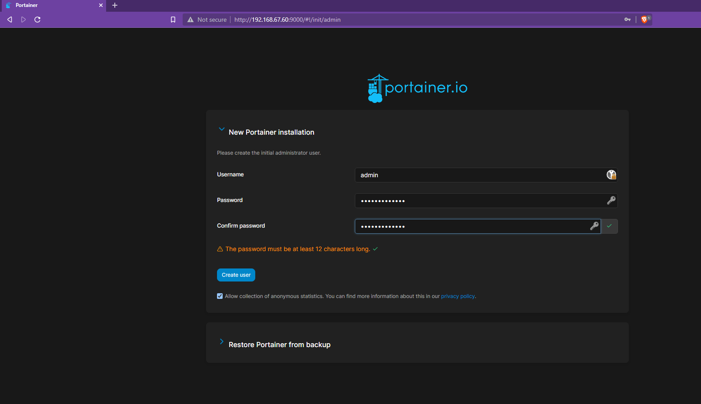

Задали пароль администратора, запустили Portainer agent и видим наше локальное окружение:

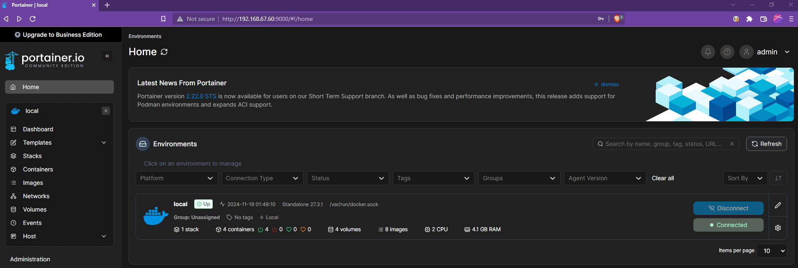


- Создали новый стек из нашего образа в локальном registry:

*Ошибся при пуше, добавив тег 1.0.0, пришлось поправить композ.*

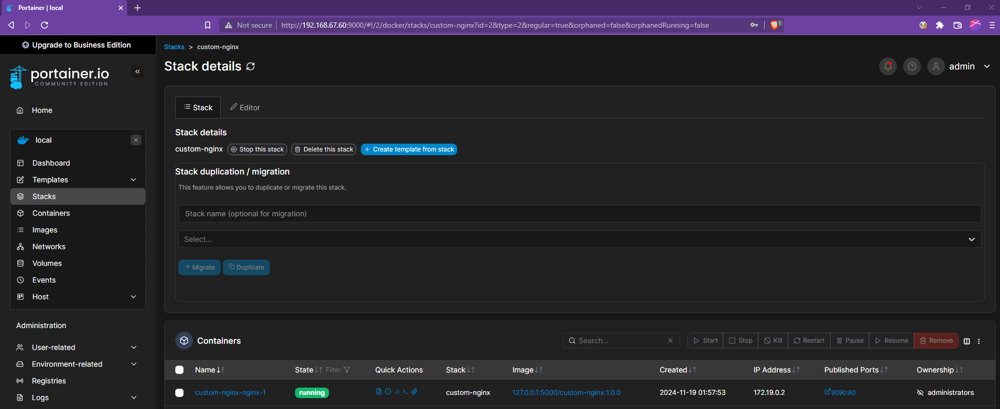

- Информация из inspect нашего контейнера:

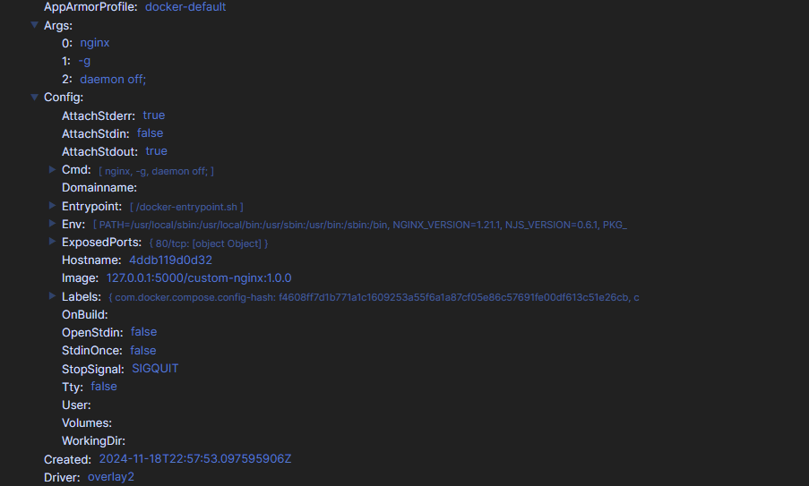

- Удалили `compose.yaml` и выполняем `docker compose up -d`. 
Compose предупреждает, что в проекте обнаружен контейнер-сирота "portainer" и предлагает его удалить,
выполнив команду с соответствующим флагом.
Это происходит потому, что в качестве имени проекта compose по умолчанию использует имя рабочего каталога.

  Запустили `docker compose up` с флагом `--remove-orphans`. 

  Остановили проект командой `docker compose down`.

  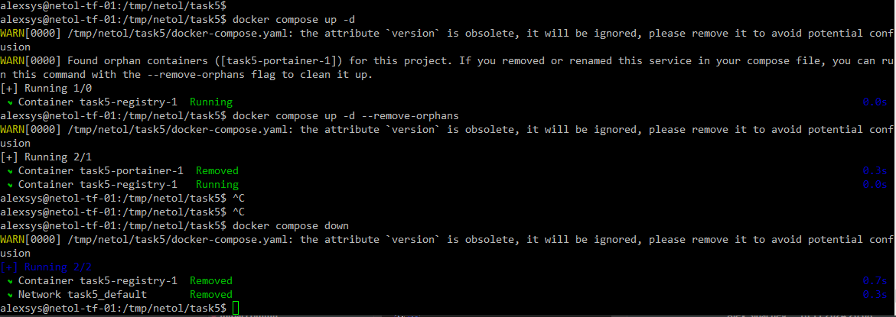

