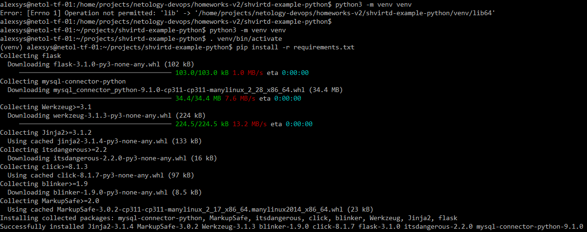
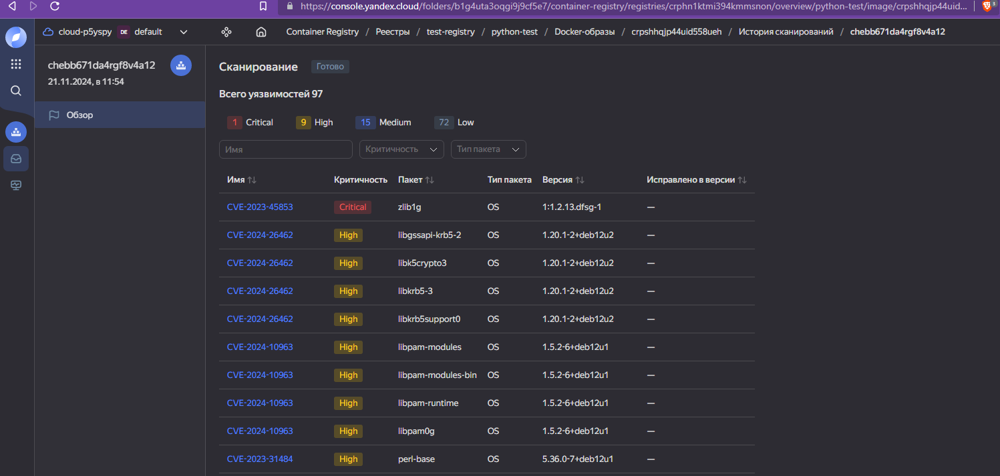

# 05. Практическое применение Docker

### Задача 1. 
1. Клонируем репозиторий с заданием : [https://github.com/Alex-AVS/shvirtd-example-python](https://github.com/Alex-AVS/shvirtd-example-python).  
2. Создаем Dockerfile для сборки:
```yaml
FROM python:3.9-slim
WORKDIR /app
RUN addgroup --system python && \
    adduser --system --disabled-password --ingroup python python && chown python:python /app
USER python
RUN python -m venv /app/venv
ENV PATH="/app/venv/bin:$PATH"
COPY --chown=python:python requirements.txt ./
RUN --mount=type=cache,target=~/.cache/pip pip install -r requirements.txt
COPY --chown=python:python . .
CMD ["python", "main.py"]
```

Выполняем сборку:


3. Для запуска проекта на локальной машине запустим временную копию Mysql в контейнере.
Создадим и выполним compose-file:
```yaml
services:
  db:
    image: mariadb:10.6.4-focal
    #networks: ["wordpress"]
    #<<: [*env_file, *restart]
    env_file:
      - .env
    environment:
      - MYSQL_ROOT_PASSWORD=${MYSQL_ROOT_PASSWORD}
      - MYSQL_DATABASE=${MYSQL_DATABASE}
      - MYSQL_USER=${MYSQL_USER}
      - MYSQL_PASSWORD=${MYSQL_PASSWORD}
      - MYSQL_ROOT_HOST="%"
    ports: ["3306:3306"]
```
Подготовим локальное окружение:



Запускаем наш проект и проверяем, как он работает:


4. Изменяем код, чтобы имя таблицы передавалось динамически (см. ветку 'task-1-4' в репозитории) и проверяем:


### Задача 2. 
 Подготавливаем YC registry и заливаем образ:


Результаты сканирования... интересные. А инструмент - полезный:




*"Docker is about running random crap from the Internet as root on your host" (c) Daniel J Walsh*

## Задача 3. 

Создаём `compose.yaml` (см. репозиторий) и стартуем проект:


Не с первой попытки, но оно заработало.


## Задача 4.
Создаём ВМ в YC, ставим docker.


Пишем простой скрипт для разворачивания приложения (см. файл `deploy.sh` в репозитории), копируем в ВМ и выполняем.
Хитрость с таймаутом ожидания запуска БД сработала плохо - в облаке не хватило времени ожидания, деплой провален :) :

 

Увеличим в опциях healthcheck start_period до минуты. Этого должно хватать.
Проверяем доступность:


Ни одного успешного ответа. Тем не менее в нашей базе что-то появилось:

 

Первый и последний - запросы в ручную из браузера. Итого, 8 запросов из потока дошли до нас. 

4.4. Создаём удалённый контекст docker и подключаемся:


И... оно не работает. Какой пользователь и с каким ключом пытается соединяться - не ясно. 
Попытки подложить локальному root приватный и/или удалённому - 
публичный (и там и там - docker service работает от root) ключ успехом не увенчались. 
Обычное подключение прекрасно работает. Нагуглить решение - не удалось.

## Задача 5.

Создаём скрипт [backup.sh](src/backup.sh) и кладём его в /opt нашей ВМ.
Запускаем... и он не работает: 


В предлагаемом образе отсутствует нужный плагин авторизации. 
Добавим. Сделаем простой Dockerfile
```yaml
FROM schnitzler/mysqldump
RUN apk add --no-cache mariadb-connector-c
```
Собираем и публикуем:


Используем его в нашей вм:


Работает.

Добавим наш скрипт в крон - `crontab -e` и добавим строку
```
* * * * * /opt/backup.sh >/var/log/backup.log 2>&1
```
Подождали. Работает:


*P.S. 1: Смысл задачи не вполне ясен. Если мы не используем встроенный функционал предложенного образа, 
то почему бы не взять уже имеющийся mysql:8? mysqldump там есть.*

*P.S. 2: Отдельный привет и "спасибо" автору примера 
https://github.com/netology-code/virtd-homeworks/blob/shvirtd-1/05-virt-04-docker-in-practice/lecture_demonstration/11.mysql-wordpress/compose.yaml 
за*

*`- MYSQL_ROOT_HOST="%" # it's very important!!!` :)*

*Мно-ого времени ушло, чтобы понять про кавычки.*

## Задача 6.
Скачиваем образ и запускаем dive:
```commandline
alexsys@netol-tf-01:/home/projects/netology-devops/homeworks-v2/netology-shvirt/04/src$ docker pull hashicorp/terraform:latest
latest: Pulling from hashicorp/terraform
5bafb31cae1b: Pull complete
458b43bffbc3: Pull complete
f7e0dccd1bf8: Pull complete
c3054bc0ebc2: Pull complete
Digest: sha256:18f9986038bbaf02cf49db9c09261c778161c51dcc7fb7e355ae8938459428cd
Status: Downloaded newer image for hashicorp/terraform:latest
docker.io/hashicorp/terraform:latest

alexsys@netol-tf-01:/home/projects/netology-devops/homeworks-v2/netology-shvirt/04/src$ docker run -ti --rm -v /var/run/docker.sock:/var/run/docker.sock wagoodman/dive hashicorp/terraform:latest
Image Source: docker://hashicorp/terraform:latest
Fetching image... (this can take a while for large images)
Analyzing image...
Building cache...

```


Сохранили хеш, экспортируем образ и распаковываем:


6.1 
Используем `docker cp`:


6.2
Экспорт через Dockerfile.

Используем Docker export actions.

Dockerfile:

```yaml
FROM scratch AS export-stage
COPY --from=hashicorp/terraform:latest /bin/terraform .
```

Выполняем:


