# 06. Оркестрация кластером Docker контейнеров на примере Docker Swarm

## Задача 1. 
Для создания ВМ воспользуемся Terraform.

ВМ в консоли YC:

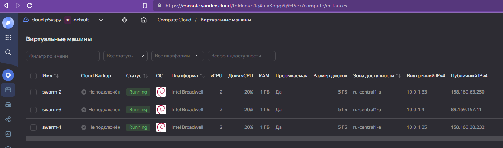

У нас есть машины с установленным Docker, конфигурировать кластер дальше будем вручную.

Инициализируем менеджер:

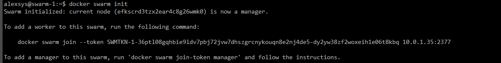

Добавляем worker ноды:

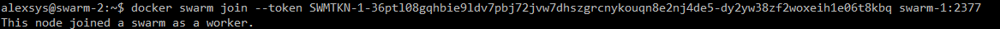

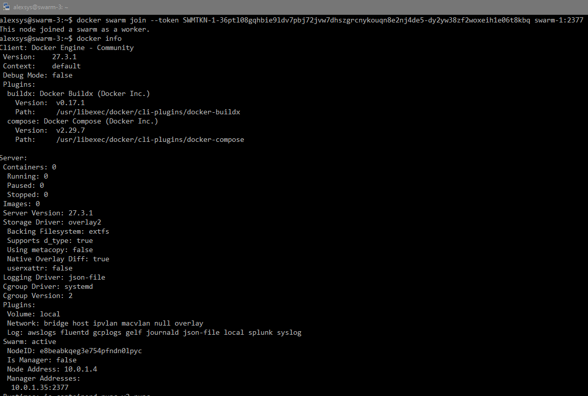

Состояние manager-node после добавления воркеров:

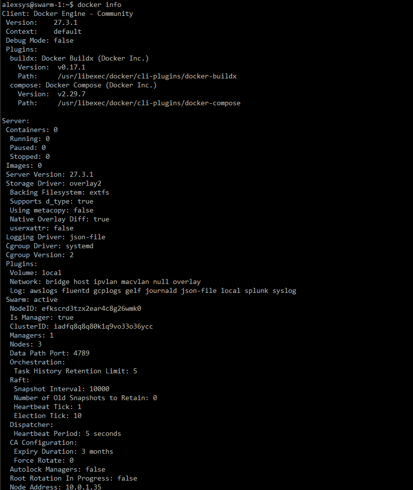

Список нод:

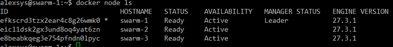
## Задача 2. 
Поскольку `docker stack` не поддерживает сборку образо в yaml-файле, опубликуем предварительно собранное приложение:

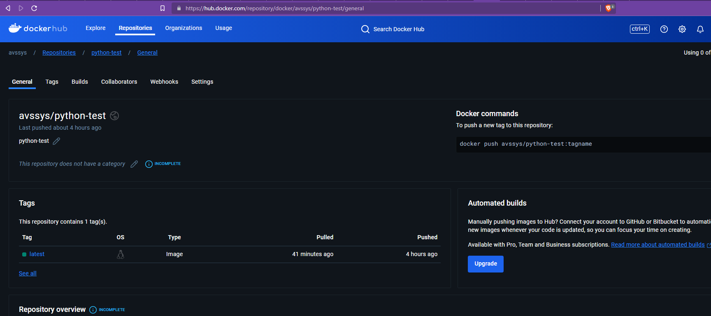

Также, нужно сильно изменить compose-файл, убрав из него неподдерживаемые swarm-режимом элементы, 
и добавив опции размещения сервисов в кластере. Нам нужно зафиксировать на определённом хосте сервисы mysql и оба прокси.
.env-файлы также не поддерживаются, поэтому здесь укажем все переменные явно. А вообще можно выполнять запуск, предварительно 
обработав файл командой  `docker compose config`:

```commandline
docker stack deploy -c <(docker compose config -f compose.yaml) stack-name-here
```

Кроме того, чтобы нормально оценить работу кластера, в качестве приложения будем использовать файл `not_tested_main.py`, 
который содержит обработку ошибок и работает корректно.

```yaml
version: "3"

services:
  db:
    image: mysql:8
    networks:
      - backend
    environment:
      MYSQL_DATABASE: virtd
      MYSQL_PASSWORD: QwErTy1234
      MYSQL_ROOT_HOST: '%'
      MYSQL_ROOT_PASSWORD: YtReWq4321
      MYSQL_USER: app
    volumes:
      - db-data:/var/lib/mysql
    deploy:
      placement:
        max_replicas_per_node: 1
        constraints: [node.role == manager]

  web:
    image: avssys/python-test:latest
    depends_on:
      - db
    environment:
      DB_HOST: db
      DB_NAME: virtd
      DB_PASSWORD: QwErTy1234
      DB_USER: app
    networks:
      - backend
    command: python not_tested_main.py

  reverse-proxy:
    image: haproxy:2.4
    restart: always
    networks:
        backend: {}
    ports:
    - "8080:8080"
    volumes:
    - ./haproxy/reverse/haproxy.cfg:/usr/local/etc/haproxy/haproxy.cfg:rw
    deploy:
      placement:
        max_replicas_per_node: 1
        constraints: [node.role == manager]

  ingress-proxy:
    image: nginx:1.21.1
    restart: always
    networks:
      - outside
    volumes:
    - ./nginx/ingress/default.conf:/etc/nginx/conf.d/default.conf:rw
    - ./nginx/ingress/nginx.conf:/etc/nginx/nginx.conf:rw
    deploy:
      placement:
        max_replicas_per_node: 1
        constraints: [node.role == manager]
networks:
  backend:
    driver: overlay
  outside:
    name: "host"
    external: true

volumes:
  db-data:
```
Кроме того, т.к. адреса контейнеров теперь не фиксированы, нужно изменить конфигурацию haproxy,
добавив обращение к бэкенду по имени:
```commandline
global
  maxconn 1000

defaults
default-server init-addr none

resolvers docker_resolver
    nameserver dns 127.0.0.11:53

frontend http_front
bind *:8080
mode http
default_backend http_back


backend http_back
balance roundrobin
mode http
server web1 web:5000 check inter 10s resolvers docker_resolver resolve-prefer ipv4
```

запускаем стек:

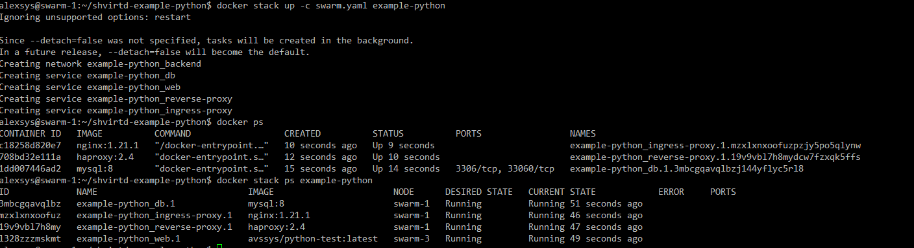

Проверяем. Работает:

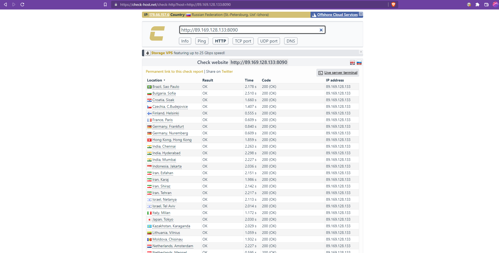

Проверяем БД:

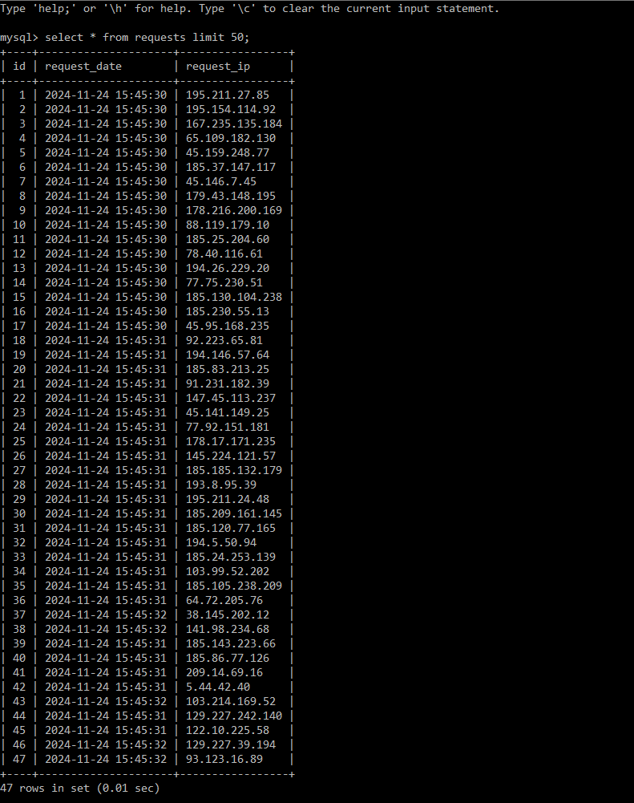
 
Теперь попробуем добавить реплик приложения. Изменим сервис веб, добавив соответствующие параметры:

```yaml
web:
    image: avssys/python-test:latest
    depends_on:
      - db
    environment:
      DB_HOST: db
      DB_NAME: virtd
      DB_PASSWORD: QwErTy1234
      DB_USER: app
    networks:
      - backend
    command: python not_tested_main.py
    deploy:
      mode: replicated
      replicas: 3
```

Запускаем и проверяем:

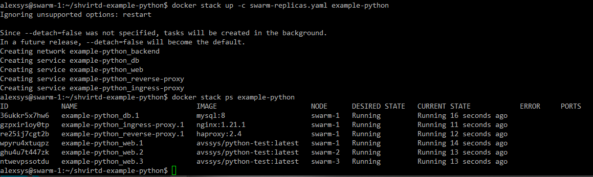

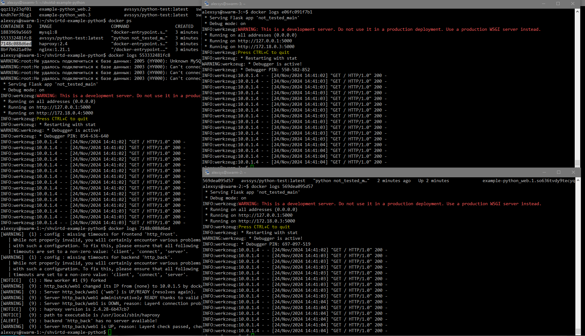

Реплики сервиса запустились на всех 3 хостах, запросы между ними распределились равномерно. 
Кластер работает.


## Задача 3. 
*TODO: вернуться после модуля по ansible.*


